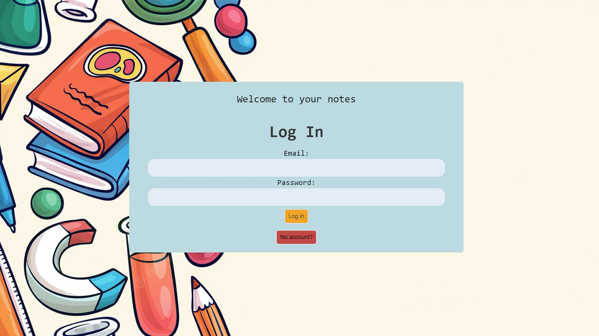
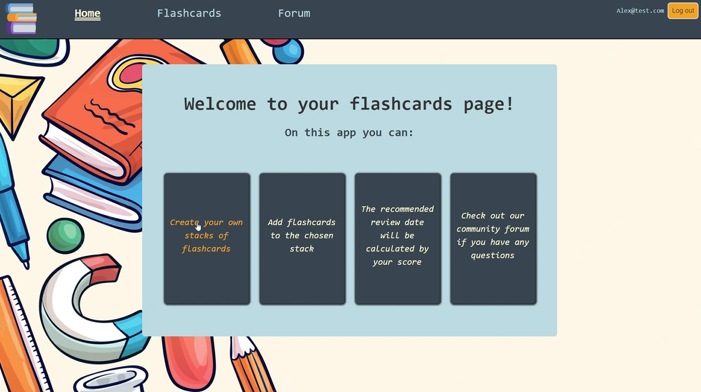
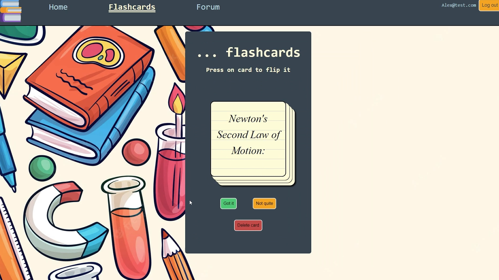
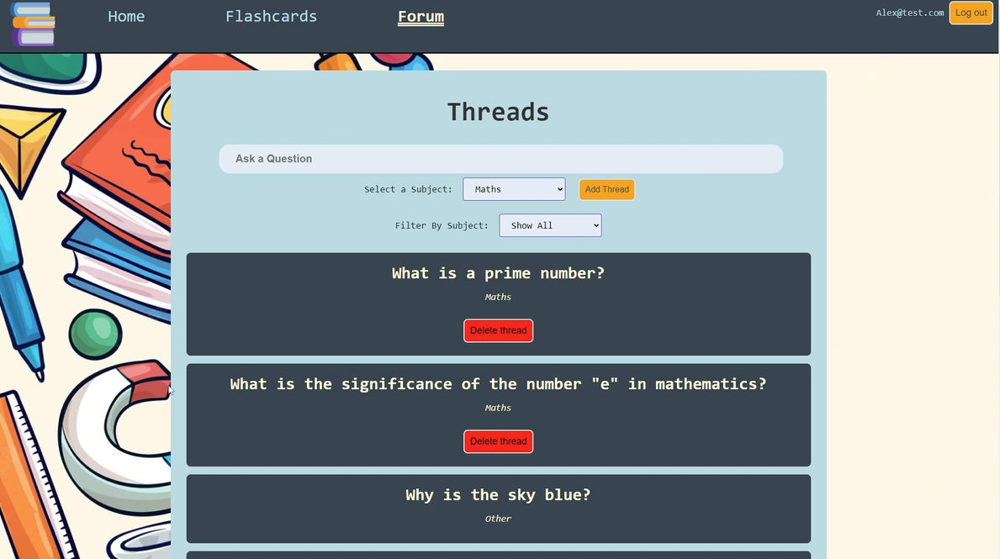

# Reddy_3_2_Back_End-
The API lets you 

# Installation & usage
## Instalation

1. Clone the repository and connect to the API folder
```sh
git https://github.com/asiek728/Reddy_3_2_Back_End-

```  

2. inside the folder create a FILE called:
```sh
 .env 
```
Once you have created it, \\\`.env`\\\ open it

4. Go to Mongo DB: 

```sh
'https://www.mongodb.com/cloud/atlas/lp/try4?utm_source=google&utm_campaign=search_gs_pl_evergreen_atlas_general_retarget-brand_gic-null_emea-all_ps-all_desktop_eng_lead&utm_term=mongodb%20setup&utm_medium=cpc_paid_search&utm_ad=e&utm_ad_campaign_id=14412646458&adgroup=151115417935&cq_cmp=14412646458&gad_source=1&gclid=EAIaIQobChMIvp208NuigwMVYpNQBh0jhwB4EAAYASAAEgI4lvD_BwE'
``` 


Instructions can be found here: 

```sh
'https://www.mongodb.com/cloud/atlas/lp/try4?utm_source=google&utm_campaign=search_gs_pl_evergreen_atlas_general_retarget-brand_gic-null_emea-all_ps-all_desktop_eng_lead&utm_term=mongdb&utm_medium=cpc_paid_search&utm_ad=p&utm_ad_campaign_id=14412646458&adgroup=151115418215&cq_cmp=14412646458&gad_source=1&gclid=EAIaIQobChMI6czCktyigwMVIJxQBh3KPgy-EAAYASAAEgIa-PD_BwE'

```

and make an account. You will then need to click 'Create new account'. 

\\\ Coppy the URL that begins with 'postgres://...'

5. Inside the `.env`  folder paste the following WITH the DB_URL being equal to the Mongo DB one you have created:

- `DB_URL=mongodb+srv://...`
- `PORT=3000`
- `SALT= (add value 10-12 here)`
- `TEST_SECRET=f61af25c624.... (random private key here)`


5. Now run the following in the console:
```sh
npm install
npm run dev #this will start the application and make it live
```
6. The server will now be running on the port listed in the console - It should be 3000.  


# Technologies used
- HTML
- Javascript
- CSS
- React
- Mongoose
- Express
- Node.js

# Process
- Brainstorming and posting all our ideas to figma board
- Creating multiple wireframes for each of the website, and choosing the best ones
- Creating a trello board with all the tasks to complete
- Completing tasks from the board one at a time
- Testing the front end and back end everyday

# Screenshots/Images






# Wins & Challenges
## Wins
- Learning how to use React and Mongoose
- Learning how to Test and add User Authentication

## Chalenges
- Getting the flashcard only belonging to a specific user
- Back end testing with authorization involved

# Future features
- Sharing flashcards with other users
- Adding difficulty levels to each flashcard
- Adding timer to each flashcard

# Important Paths
- /flashStacks          - get all stacks with flashcards
- /flashStacks/:id      - get all flashcards for a stack with the specific id
- /flashCards           - get all flashcards
- /flashCards/:id       - get flashcard with a specific id
- /comments             - get all comments
- /comments/:id         - get comment with a specific id
- /threads              - get all threads
- /threads/:id          - get thread with a specific id
